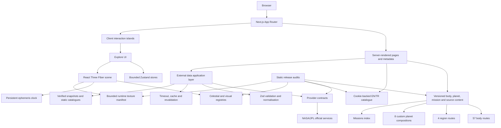

# Architecture Diagram

## Ownership summary

- Server pages own metadata, locale resolution and external-data loading.
- Provider adapters own URL construction, timeout, validation, normalisation and fallback selection.
- Client stores own bounded interaction state, never reference scientific truth.
- `CameraRig` and the persistent ephemeris controller are the scene authorities.
- Lightweight route registries feed sitemap/navigation without importing full editorial models.
- Runtime assets enter the release only through the manifest and provenance audits.
